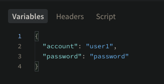
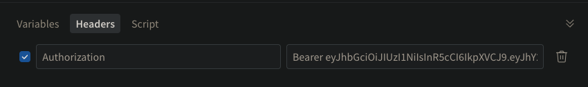

# 程式啟動方式
## clone project
```
git clone https://github.com/mt5718214/wonderpet-graphQL.git
```
## install the dependencies
```
npm install
```

## start the app
```
npm run app
```

# 程式架構
```bash
├── app.ts            # 主程式進入點
├── config.ts         # config設定檔
├── data
│   └── user.json     # 存放使用者資料的 JSON 檔案
├── gql
│   ├── index.ts      # GraphQL module的入口文件，包含導出所有相關的 schema 和 resolvers
│   ├── resolvers.ts  # GraphQL 解析函數
│   └── schema.ts     # GraphQL Schema 定義
├── package-lock.json
├── package.json
├── tsconfig.json
├── types.ts          # 一些自定義的type, interface
└── util
    └── commonTool.ts # 常用工具函數 (password加解密, jwt驗證, 讀取json資料)
```

# api 的規格與範例
## endpoint
```
query Login($account: String!, $password: String!) {
  login(account: $account, password: $password) {
    data
    msg
  }
}
```
### Login帶入參數


```
query Me {
  me {
    data {
      birthday
      account
      name
    }
    msg
    errormsg
  }
}
```
### Headers Authorization 帶入token


## User's login info
```
{
  "account": "user1",
  "password": "password",
},
{
  "account": "user2",
  "password": "andy1234",
},
{
  "account": "user3",
  "password": "su3y942l487",
}
```

# 研究心得
